# Multiforum

This is a work in progress that intended to be an open-source, self-hosted platform that lets you host multiple forums.

## Video Demo

## Overview

Each forum has two sections, a discussion section and a calendar. In the discussion section, content
can be upvoted so that the best content rises to the top. In the event section, anyone can post
an event that participants in the community may be interested in.

Events can be submitted to multiple forums to increase visibility of them and
help promote them. The same can be done with text-based discussion posts.

To solve the problem where you're bored on the weekend but you don't know what to do in your area, events can be searched across multiple forums based on location, tags and keyword. Screenshots are below.

When the project is finished, I will add documentation so that anyone can deploy their own Multiforum with custom branding.

## Screenshots - Desktop width

The below screenshots capture the state of the project as of January 2024. The layout is responsive with both desktop and mobile views.

### Sitewide event search - filtering by time

Here's how it looks if you filter all in-person events by 'next weekend.' If today is during the week of
Monday, June 17, then the events are filtered to show events on Saturday the 22nd and Sunday the 23rd:

### Highlighting events on the map

If you mouse over an event list item or map marker, an info window pops up on the map
and the list item is also highlighted. This is supposed to make it easier to draw a connection
between the two:

Here's another example showing what happens if you hover over an event in the map view:

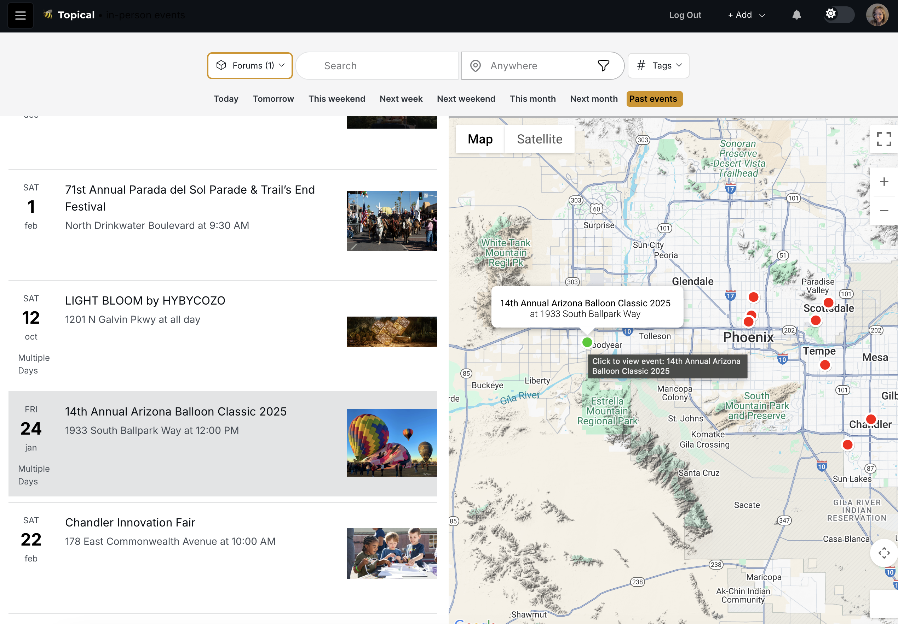

### Filtering the map by forums

If I'm only interested in events from a few specific forums, I filter the 
map by those forums:

Note: The above component for selecting forums is unwieldy and I'll be replacing it
with something more compact.

The resulting event list is now filtered by the two forums I selected - the writers group
and the birdwatching one. All of the concerts are no longer in the list and their map
markers are no longer on the map:

### Clicking forum name in event drawer

If you're looking at events from the map view, and you click on one, the details
will show up in a drawer:

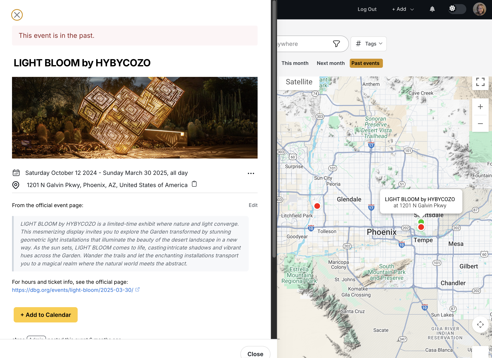

In that drawer you can see what forums that event was
submitted to. If you click the forum name it will take you to the event page in
the context of that forum:

Screenshots of event detail pages within a forum are below.

### Multiple events at the same location

Some map markers indicate that there are multiple events at the same location. If
you click that, you can see the list of events that are taking place there at different times:

Here's another example of how it looks when you click on a location with multiple events. In 
this case, the events are both at the same concert venue, Crescent Ballroom:

### Clicking a single event

If you click on an event list item or map marker for a single event, the details of that event show
in a drawer (the drawer also contains permanent links to the event's detail page, useful for sharing event details):

### Event list within a forum

Each forum can have its own list of upcoming events. In this example, a forum about
rock music in Phoenix is promoting events at multiple venues. Meanwhile, the
forum sidebar shows the handful of events which are coming up the soonest, so that
they are visible even when the Discussions tab is active:

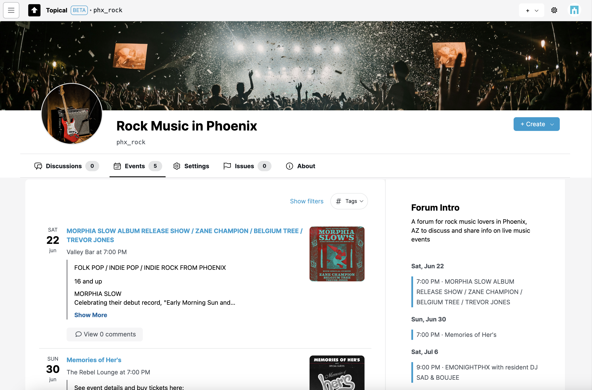

In this particular example, hypothetically, the venues may host a variety of events
in multiple musical genres but these particular ones would be of interest to people
who like rock music. So in that way, the forum can be used as a way to organize
public information about events and promote them to the people who find them most relevant. 

(The screenshots may not show the best examples. Morphia Slow categorizes 
herself as "Folk-Murder-Pop", but you get the idea.)

Events can be filtered within a forum. This screenshot shows how it looks when
events in "Phoenix Bird Lovers" are filtered to show only events next weekend:

Here are the events filtered by location. In this case they are filtered to show
events within 10 miles of Tempe:

### Discussion list within a forum

A birdwatching forum is an example of a forum that could make use of both in-person events
and online discussions with people who may never attend any events. For example, someone
who takes a picture of an unfamiliar bird in Phoenix might ask the Phoenix birdwatchers what it is.
That's when the Discussions tab within a forum would come in handy:

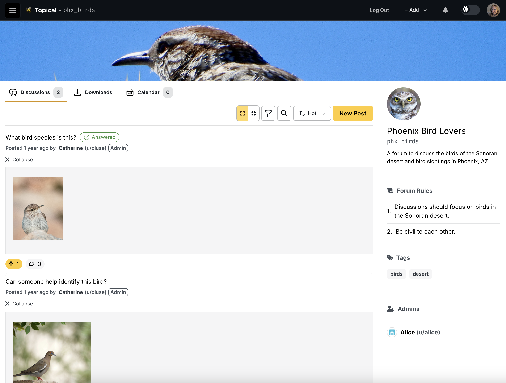

### Discussion detail

If you click an item in the discussion list, it goes to the discussion detail view, which contains
the comments. In the case of a birdwatching group, maybe there's a comment identifying the bird:

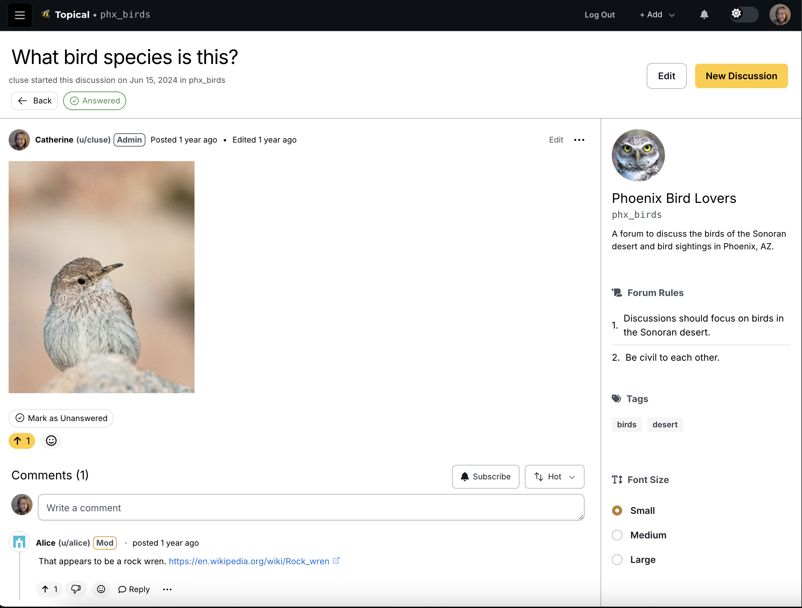

### Forum without any events

Events are optional for forums. I intend to make it possible for a forum to turn
off the events tab. The Discussions tab is the main landing page, especially for forums
that could be focused on technical questions and answers, which would
have no need for events:

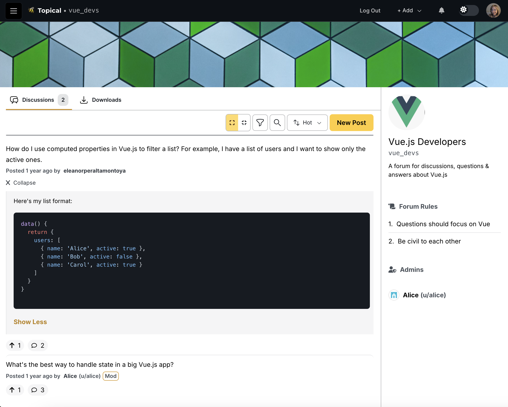

### Submitting an event to forums

You can share an event to one or more forums. In a typical use case, you would link to an official
event page with the full details and information about how to buy tickets, if applicable.

Submitting an event to multiple forums is a good way to increase the visibility of the event. This one will now be visible in the context of both of the selected forums:

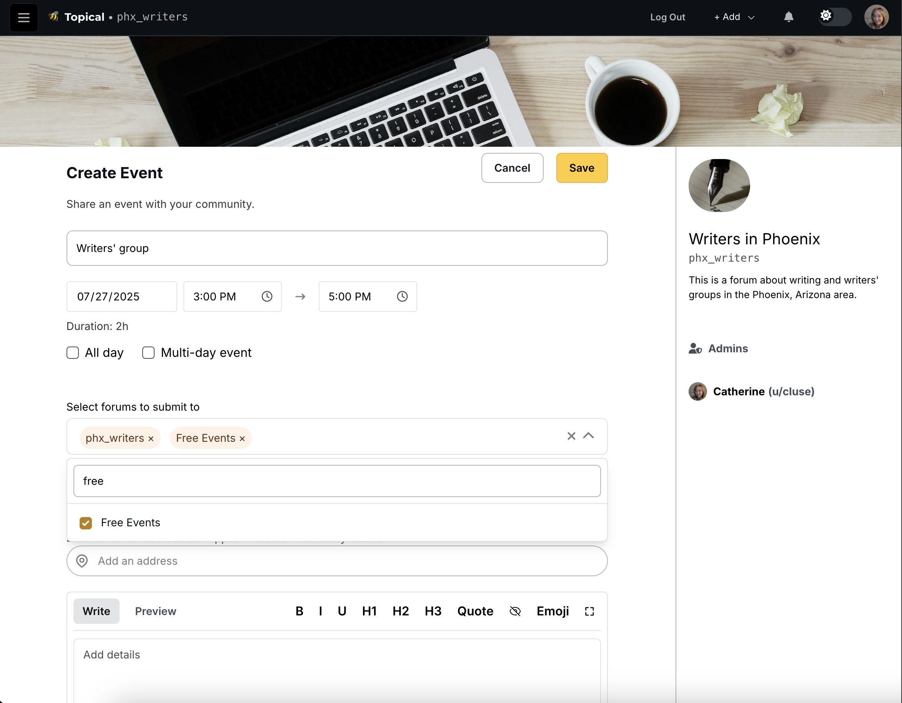

If you add an address, the event will be discoverable from the sitewide event search page (the map view):

### Recently visited forums

If you click the menu button on the top left of any page, it shows recently visited forums
to support easy context switching.

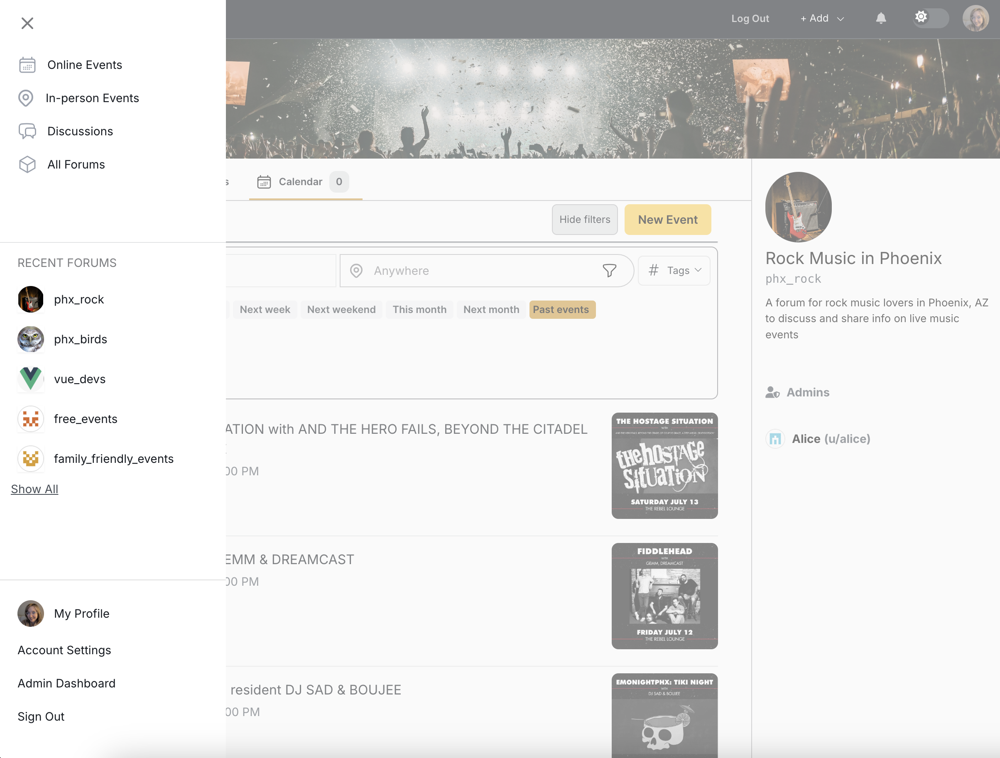

## Screenshots - Mobile width

### Discussion list views within a forum

Here's the discussion list within a single forum, at mobile width:

Here's another example of a discussion list view at mobile width:

### Event list view within a forum

Here's the list of events within a specific forum:

### Event detail page

This screenshot shows how an event detail page looks at mobile width, if you
come to it from within the context of an individual forum:

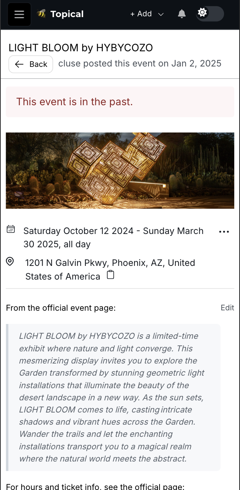

### Discussion detail page

This screenshot shows how a discussion detail page looks at mobile width, if
you come to it from within the context of an individual forum:

### Sitewide event list

Here's the sitewide in-person event list with an active filter,
shown here at mobile width. All the same filtering features work at mobile width
as well. Here, the events are filtered by the birdwatching forum,
so not all of the map markers are displayed.

### List of all forums

Here is the list of forums at mobile width:

The list of forums can be filtered by tag:

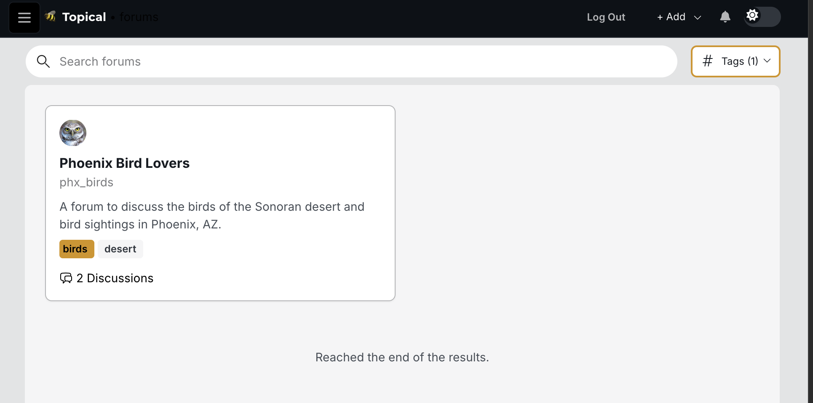

The forum list can be filtered by search terms as well:

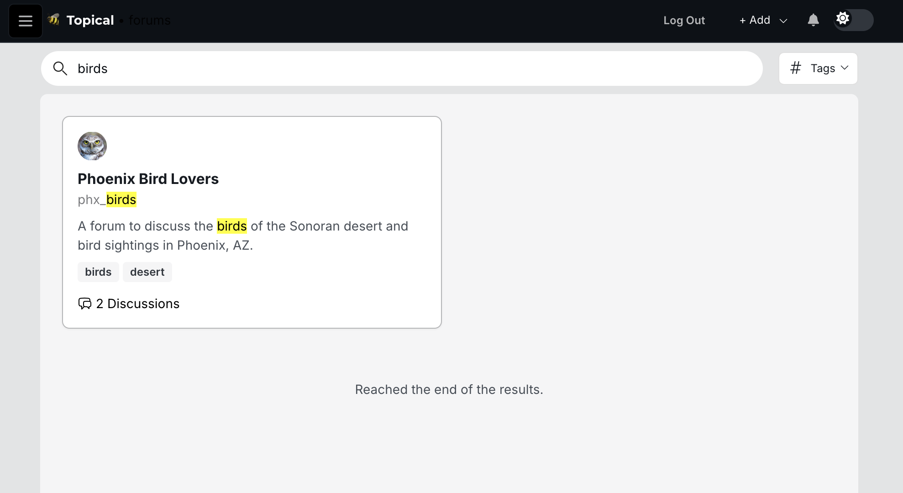

## Technology Stack

On the backend (https://github.com/gennit-project/multiforum-backend), an Apollo server fetches data from the database (a graph database, Neo4j). Some resolvers are auto-generated using the [Neo4j graphql library](https://neo4j.com/docs/graphql/current/), while more complex resolvers are implemented using a combination of the [OGM](https://neo4j.com/docs/graphql/current/ogm/) and custom Cypher queries.

The frontend is a Vue application that makes GraphQL queries to the Apollo server.

## Environment Variables

I will fill out this section when the project is finished, or if someone expresses interest in collaborating on this project, whichever comes sooner. Anyone interested can contact me at catherine.luse@gmail.com.

## Tests

Integration tests are in the `cypress` directory and cover all the create, read, update and delete operations on forums, events, discussions and comments, as well as the filtering in the list views.

## Project status

I'm currently working on what I feel is the boring part of the project - permissions,
roles and content moderation features.

After that, some of the next-up features are:

- Clean up the component for forum filtering and make it work more like autocomplete.
- Add the multiforum feature (which is what the app is named after), which is a group of forums. Filtering by a multiforum will show content from all forums in that group.
- The ability for OP to mark a comment as the best answer to their question.
- The ability to manage recurring events and easily clone a past event to make a new one.
- Search in the top nav.
- The ability to 'super upvote' a post or comment if you write something nice on the author's 
  public scratchpad... or tip them.
- Bundled notifications.
- The ability to put downloadable files in a discussion post - useful for sharing video game
  mods and the like.
- The ability to gate some of the above downloadable files behind a paywall and other 
  monetization features.
