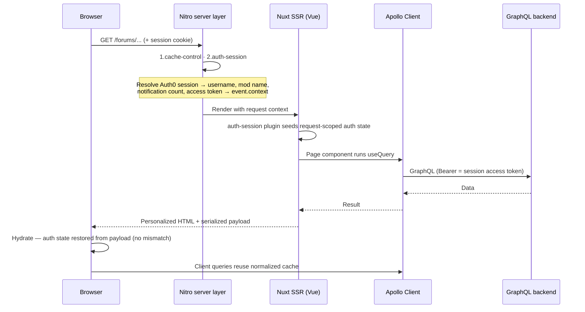

# Frontend Architecture and Authentication

This document describes how the Multiforum frontend is structured and the
reasoning behind its main technology choices. It is the frontend counterpart to
the backend's [architecture overview](https://github.com/gennit-project/multiforum-backend/blob/main/docs/architecture.md).

> **Looking for the data model?** The GraphQL schema, resolver design, and
> Neo4j/Cypher details live in the backend repository:
> [gennit-project/multiforum-backend](https://github.com/gennit-project/multiforum-backend)
> — start with its [architecture overview](https://github.com/gennit-project/multiforum-backend/blob/main/docs/architecture.md).
> For the moderation/permission model as it appears in this UI, see
> [moderation-architecture.md](./moderation-architecture.md).

## Overview

The frontend is a server-side-rendered [Vue](https://vuejs.org/) application
built with [Nuxt](https://nuxt.com/). It talks to the backend exclusively
through GraphQL. A request passes through a series of concerns, each handled in
one place:

| Concern | Responsibility | Where it lives |
| --- | --- | --- |
| Nitro server layer | SSR request handling, auth session, caching, auth/session API routes | `server/` |
| Rendering | SSR + hydration of Vue components, routing | `pages/`, `layouts/`, `components/` |
| Data | GraphQL queries/mutations, Apollo cache, generated types | `graphQLData/`, `__generated__/`, `plugins/apollo-*` |
| State | Cross-component UI state, request-scoped auth state | `stores/`, `composables/` |
| Authentication | Auth0 login, server sessions, SSR-aware auth state | `server/`, `plugins/auth-session.ts`, `composables/useAuthState.ts` |
| Presentation logic | Reusable behavior extracted from components | `composables/`, `utils/` |

Keeping these separate means each can be read, changed, and tested on its own —
a permission composable without touching a page, a GraphQL query without
touching the Apollo wiring, the auth session without touching component code.

## Page render lifecycle

Because SSR is **auth-aware** (see [Authentication](#authentication-and-sessions)),
a request is personalized on the server from the user's session and then
hydrated on the client with matching state.

## Layers in detail

### Nitro server layer (backend-for-frontend)

Nuxt ships a [Nitro](https://nitro.build/) server, and this app uses it as a
small backend-for-frontend under [`server/`](../server):

- **Middleware**, ordered by numeric filename prefix:
  [`1.cache-control.ts`](../server/middleware/1.cache-control.ts) and
  [`2.auth-session.ts`](../server/middleware/2.auth-session.ts). The latter
  reads the Auth0 session (`useAuth0(event)` is a server-only auto-import),
  resolves the caller's application username from the backend, and stashes a
  small POJO plus the API access token on `event.context` for the SSR render.
- **Session store** —
  [`session-store-factory.ts`](../server/utils/session-store-factory.ts)
  implements a driver-agnostic `SessionStore` over the
  [unstorage](https://unstorage.unjs.io/) interface, so only a session id lives
  in the cookie and the tokens live server-side (the default cookie-only store
  overflows the ~4KB limit once a refresh token is present).
- **Auth/session API routes** under [`server/api/`](../server/api) expose the
  session access token and profile to the client (used by the embedded-browser
  token fallback).
- **Caching** is configured in [`nuxt.config.ts`](../nuxt.config.ts) via Nitro
  `routeRules` and storage mounts (Upstash Redis in production, filesystem in
  dev). Auth-personalized forum detail pages are deliberately **not** route
  cached — a shared cache would leak one user's personalized render to others.

### Rendering — Nuxt SSR + hydration

Pages live under [`pages/`](../pages) using Nuxt's file-based routing, which maps
cleanly onto the app's many nested routes
(`/forums/[forumId]/discussions/[discussionId]`, etc.). The first render is
produced on the server and hydrated into a live app in the browser. SSR matters
here for discoverability (public forum content is crawlable), fast first paint,
and hydration-safe auth.

Hydration mismatches are the main hazard of auth-aware SSR. The discipline for
avoiding them — wrapping client-dependent conditionals in `<ClientOnly>` at the
source, keeping SSR logic on cookies/session rather than `localStorage` — is
documented in [CLAUDE.md](../CLAUDE.md#ssr-and-hydration).

### Data — GraphQL, Apollo Client, generated types

The app queries the backend through [Apollo Client](https://www.apollographql.com/docs/react/)
(via [`@nuxtjs/apollo`](https://apollo.nuxtjs.org/)), which provides a normalized
cache so repeated views of the same entity stay consistent without manual
bookkeeping.

- **Queries and mutations** are authored as `gql` documents under
  [`graphQLData/`](../graphQLData), organized by domain (`discussion/`,
  `comment/`, `channel/`, `event/`, `issue/`, …).
- **Types** are generated from the backend schema into
  [`__generated__/`](../__generated__) (`pnpm run compile`, config in
  [`codegen.ts`](../codegen.ts)). Components import these generated types
  (`Discussion`, `Comment`, `Event`, …) so the API contract and the UI cannot
  silently drift.
- **Auth on requests** is handled by two small plugins so SSR and client both
  send the right token — see [Authentication](#authentication-and-sessions).

### State — stores, request-scoped auth, and local refs

State lives at the narrowest scope that works:

- **Local `ref`** for state a single component owns (the default).
- **[Pinia](https://pinia.vuejs.org/) stores** in [`stores/`](../stores) for UI
  state several components share — `uiStore` (theme, layout), `toastStore`
  (notifications), `addToListModalStore`. **Toasts must go through the Pinia
  `toastStore`**; only it is rendered.
- **Request-scoped auth state** in
  [`composables/useAuthState.ts`](../composables/useAuthState.ts), built on
  Nuxt's `useState` rather than module-level refs. This is deliberate: module
  refs are shared across every request on a server instance, so on the
  serverless runtime one user's auth state could bleed into another user's SSR
  render. `useState` is keyed to the current request and serializes into the
  Nuxt payload, so the client restores the exact same values on hydration.
- **Composables** in [`composables/`](../composables) extract reusable behavior
  (permissions, moderation actions, form logic) out of components so it can be
  unit-tested directly.

### Authentication and sessions

Multiforum uses [Auth0](https://auth0.com/) with a **server-session** model (via
[`@auth0/auth0-nuxt`](https://github.com/auth0/auth0-nuxt)). The session cookie
holds only a session id; tokens live in the server-side session store. SSR is
auth-aware: the server personalizes the HTML from the session so owner/moderator
controls and vote state are correct on first paint, with no flash of wrong UI.

**How auth flows through a request:**

1. **Login** goes through Auth0; the auth routes registered by `@auth0/auth0-nuxt`
   establish a server session (small session-id cookie).
2. **On the server**, [`server/middleware/2.auth-session.ts`](../server/middleware/2.auth-session.ts)
   reads the session, resolves the application username and profile from the
   backend (`getOwnEmail`, cached per-email with a TTL), and leaves the profile
   plus the API access token on `event.context`.
3. **During SSR**, [`plugins/auth-session.ts`](../plugins/auth-session.ts) seeds
   the request-scoped auth state from that context, and
   [`plugins/apollo-ssr-auth.ts`](../plugins/apollo-ssr-auth.ts) hands the access
   token to Apollo so server-side GraphQL queries are authenticated — matching
   what the client will fetch (this is what prevents permission-gated hydration
   mismatches).
4. **On the client**, [`plugins/apollo-auth.client.ts`](../plugins/apollo-auth.client.ts)
   keeps Apollo's token in sync; where `localStorage` is unavailable (embedded
   browsers), it falls back to the session-backed `/api/session/token` endpoint.
5. **Reading auth state** in components uses the `useAuthState` composables
   (`useIsAuthenticated()`, `useUsername()`, `useModProfileName()`, …); the
   [`RequireAuth`](../components/auth/RequireAuth.vue) component gates auth-aware
   UI.

> **Note:** an earlier client-side SPA model (`useSSRAuth`/`useAuthManager` with
> `localStorage` as the source of truth) was replaced by the server-session
> model above; the composables and flow described here are the current ones.

## Data model: why a graph

The product is relationship-dense — cross-posted content, threaded comments,
channel roles, votes, and moderation spanning server and channel scope. The
backend stores this in a [Neo4j](https://neo4j.com/) graph so those traversals
are edge walks rather than multi-table joins, and GraphQL lets each screen fetch
exactly the connected data it needs in one request. The full rationale and the
schema live in the
[backend architecture doc](https://github.com/gennit-project/multiforum-backend/blob/main/docs/architecture.md).

## Reliability and developer experience

- **End-to-end types.** TypeScript in strict mode; GraphQL types are generated
  from the schema, so a screen and the API contract can't silently diverge. Type
  checking runs via `pnpm run tsc` (`vue-tsc`).
- **Tested at two levels.** Unit/component tests run on
  [Vitest](https://vitest.dev/) + Vue Test Utils (`pnpm run test:unit`);
  end-to-end flows run on [Playwright](https://playwright.dev/) with **mocked
  GraphQL**, so E2E needs no backend (`pnpm run test:playwright`). See
  [automated-test-plan.md](./automated-test-plan.md).
- **Pre-commit gates.** Husky runs type checking and unit tests, and ESLint
  (with accessibility rules) on staged files, before each commit.
- **Performance.** Code splitting, caching, and image optimization are covered
  in [performance.md](./performance.md).

## Repository map

| Path | Contents |
| --- | --- |
| [`pages/`](../pages) | File-based routes; thin page wrappers over feature components |
| [`components/`](../components) | Vue components, grouped by feature (`discussion/`, `comments/`, `event/`, `mod/`, …) |
| [`layouts/`](../layouts) | App layout shell |
| [`graphQLData/`](../graphQLData) | GraphQL queries/mutations as `gql` documents, by domain |
| [`__generated__/`](../__generated__) | Generated GraphQL types (from `codegen.ts`) |
| [`composables/`](../composables) | Reusable logic (auth state, permissions, moderation, forms) |
| [`stores/`](../stores) | Pinia stores for shared UI state |
| [`plugins/`](../plugins) | Nuxt plugins (Apollo auth wiring, auth-session seeding, Vuetify, maps) |
| [`server/`](../server) | Nitro backend-for-frontend: middleware, session store, auth/session API routes |
| [`middleware/`](../middleware) | Route middleware |
| [`utils/`](../utils) | Pure helpers (filters, formatting, permission utilities) |
| [`types/`](../types) | Hand-written TypeScript types complementing the generated ones |
| [`nuxt.config.ts`](../nuxt.config.ts) | Nuxt/Nitro config: modules, storage mounts, route caching |
| [`docs/`](.) | This documentation |
